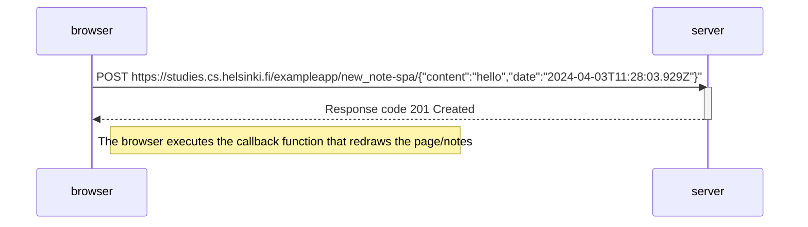

```mermaid
	sequenceDiagram
		participant browser
		participant server

		browser->>server: POST https://studies.cs.helsinki.fi/exampleapp/new_note-spa/{"content":"hello","date":"2024-04-03T11:28:03.929Z"}"
		activate server
		server-->>browser: Response code 201 Created
		deactivate server

		Note right of browser: The browser executes the callback function that redraws the page/notes
```